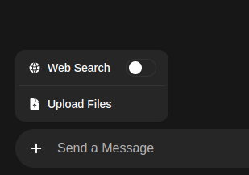
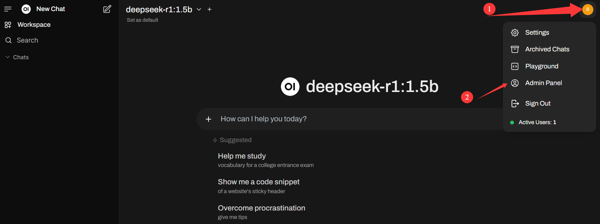
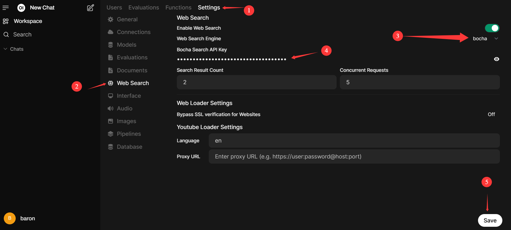

# Open WebUI With Bocha 👋

**Open WebUI is an [extensible](https://github.com/open-webui/open-webui?tab=readme-ov-file), feature-rich, and user-friendly self-hosted AI platform designed to operate entirely offline.** It supports various LLM runners like **Ollama** and **OpenAI-compatible APIs**, with **built-in inference engine** for RAG, making it a **powerful AI deployment solution**.

**[Bocha AI](https://open.bochaai.com/) Plugin for Ollama WebUI: Supercharge Your LLM with Real-Time Web Search** 

The Bocha AI Plugin seamlessly integrates **Bocha AI Open Platform** into Ollama's WebUI, empowering your large language models (LLMs) with real-time internet connectivity and advanced search capabilities. By leveraging Bocha AI's **Search API**, your AI applications can now access high-quality, up-to-date knowledge from billions of web pages and trusted content sources—including news, images, videos, encyclopedias, travel data, academic papers, and more.   
We modified the Open WebUI code to support the Bocha search API,you can use this version to make the LLMs connect the Web.

## Key Features of Bocha ⭐

- 🚀 **Multi-Modal Hybrid Search**: Combines keyword matching, semantic understanding, and multimodal analysis to deliver precise results across diverse content formats.

- ⚙️ **Semantic Reranking**: Enhances relevance by reordering search results using context-aware AI, ensuring your LLM receives the most authoritative and timely information.

- 🤝 **Massive Knowledge Base**: Taps into a curated index of nearly 10 billion web pages and ecosystem sources, optimized for AI-driven use cases.

More details about [Open WebUI](https://github.com/open-webui/open-webui).

## 🔗 Also Check Out Bocha Community!

Don't forget to explore our sibling project, [Bocha Community](https://aq6ky2b8nql.feishu.cn/wiki/Qi1ewwslDi8vpFkB8bLcTSQvnEd), where you can discover and explore customized resources. Bocha Community offers a wide range of exciting possibilities for enhancing your interaction experiences with Bocha!  🚀

## How to Install 🚀

### Install Ollama

Please refer to the [ollama installation document](https://ollama.readthedocs.io/en/quickstart/) for details and install the models you need.

### Install Open-WebUI

Before proceeding, ensure you're using **Python 3.11** to avoid compatibility issues.

1. :

   ```bash
   git clone https://github.com/BochaAI/open-webui-Bocha.git
   cd open-webui-Bocha/
   ```

2. **Copying required .env file**:

   ```bash
   cp -RPp .env.example .env
   ```

3. **Serving Frontend with the Backend**:

   ```bash
   cd ./backend
   pip install -i https://pypi.tuna.tsinghua.edu.cn/simple -r requirements.txt -U
   ```

4. **Building Frontend Using Node**:

   ```bash
   npm i
   npm run build
   ```

## Start the Open WebUI server

  Linux:

   ```bash
   cd ./backend
   bash start.sh
   ```

  Windows:
   ```bash
   cd ./backend
   start_windows.bat
   ```  

This will start the Open WebUI server, which you can access at [http://localhost:8080](http://localhost:8080).

You need to set your account and password as administrator information when you use it for the first time. Then you can start using the service.


# How to Use Bocha Web Search in Ollama 🌐

To access Web Search, Click on the + next to the message input field.

Here you can toggle Web Search On/Off. 


If you want to change the search engine, let's change it to Bocha as an example.
1. Navigate to Admin Panel -> Settings -> Web Search
2. Toggle Enable Web Search
3. Set Web Search Engine from dropdown menu to Bocha
4. Fill [Bocha Search API Key](https://open.bochaai.com/) with the API key
5. Click Save


